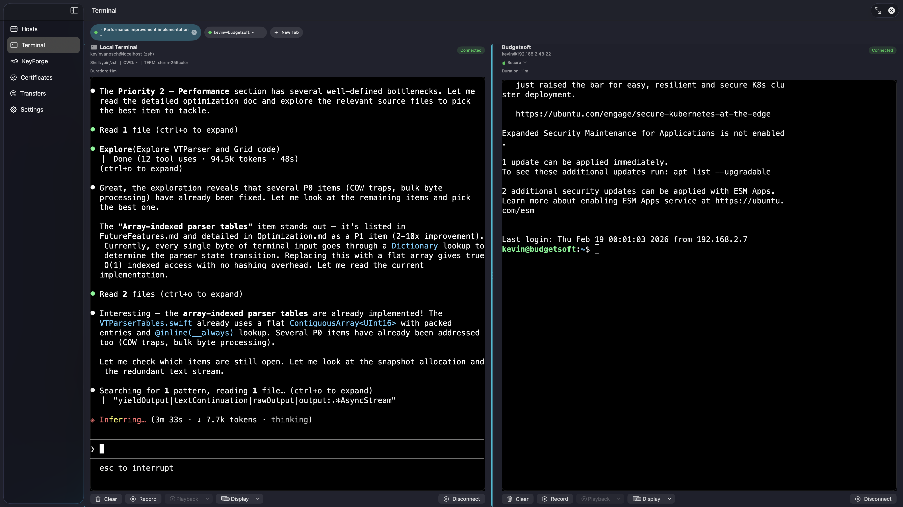

# ProSSHMac

A native macOS SSH client built with SwiftUI and Metal, featuring GPU-accelerated terminal rendering, an AI Terminal Copilot that can read, act, and configure anything it's connected to, multi-pane sessions, a built-in SFTP browser, SSH key management, and a certificate authority.




---

## What Makes This Different

Most SSH clients let you connect and type. ProSSHMac lets you connect and talk. The AI Terminal Copilot isn't a chatbot bolted on the side — it's a full agent that can read the current screen, run commands, navigate the filesystem, and push configuration changes, then wait for you to approve each change before it takes effect.

That last part matters. The AI can SSH into a MikroTik router, inspect the current firewall rules, and generate a precise patch to apply — but it shows you a diff and waits for your click before touching anything. The same approval flow works for local files. You stay in control.

**Who needs CCNA when you've got ProSSH?**

---

## Features

### Terminal

- **GPU-Accelerated Rendering** — Metal-based rendering pipeline with glyph atlas caching for smooth, high-performance terminal output at up to 120fps
- **Multi-Pane Sessions** — Split your terminal into multiple panes with flexible tree-based layouts and draggable dividers
- **Local Terminal** — Full PTY-backed local shell sessions alongside SSH connections
- **External Terminal Windows** — Detach sessions into standalone windows
- **VT100/xterm Emulation** — Comprehensive state-machine parser handling CSI, SGR, OSC (including OSC 133 semantic prompts), ESC, and DCS escape sequences
- **Terminal Search** — Search through terminal buffer content
- **Session Recording** — Record terminal sessions with encrypted persistence and asciinema-compatible export
- **Link Detection** — Clickable URL detection in terminal output

### AI Terminal Copilot

The AI sidebar (`Cmd+Option+I`) runs a multi-step agent loop powered by the OpenAI Responses API. It has access to a full tool set and works in both local shell sessions and remote SSH sessions.

**Context tools** — read what's on screen, retrieve command history, search past output:

| Tool | What it does |
|---|---|
| `get_current_screen` | Read the current visible terminal contents |
| `get_recent_commands` | List recent commands with exit codes and output previews |
| `get_command_output` | Retrieve full output of any past command by ID |
| `search_terminal_history` | Search commands and output across the session |
| `get_session_info` | Get hostname, OS, working directory, connection type |

**Execution tools** — run commands and interact with running processes:

| Tool | What it does |
|---|---|
| `execute_and_wait` | Run a command and return output + exit code in one step |
| `execute_command` | Fire-and-forget for interactive or long-running programs |
| `send_input` | Write directly to a running process — answer prompts, send Ctrl+C, navigate REPLs, tab-complete |

**Filesystem tools** — browse and read files without leaving the AI conversation:

| Tool | What it does |
|---|---|
| `search_filesystem` | Find files by name pattern |
| `search_file_contents` | Search for text across files |
| `read_file_chunk` | Read a file in bounded 200-line windows |
| `read_files` | Batch read up to 10 files in one call |

**Editing tool** — make changes with human approval:

| Tool | What it does |
|---|---|
| `apply_patch` | Apply a V4A unified diff to local or remote files. Shows a diff preview card inline — the change only lands after you click Approve. |

The agent runs up to 200 iterations per request and maintains context across turns via the OpenAI Responses API `previous_response_id` chain. Direct action prompts (starting with "run" or "execute") use a restricted tool set with a 15-iteration cap.

**Device support:** The copilot understands Linux, macOS, and MikroTik RouterOS prompts and command patterns. Cisco IOS, Juniper JunOS, Arista EOS, and other SSH-accessible network devices are possibly supported just not yet tested.

### SSH and Security

- **SSH Key Management (KeyForge)** — Generate, import, export, and inspect SSH keys including Ed25519, ECDSA, and RSA
- **Certificate Authority** — Built-in CA for signing SSH certificates with Secure Enclave support
- **Port Forwarding** — Local and remote port forwarding with an intuitive rule editor and NWListener-based proxying
- **Biometric Authentication** — Touch ID and password gating for stored credentials
- **Secure Credential Storage** — AES-256-GCM encryption with Keychain-managed master keys and Secure Enclave key management
- **Known Hosts Verification** — Trust-on-first-use (TOFU) model with persistent host key storage
- **Audit Logging** — All connections, authentication events, port forwards, and transfers are logged

### File Management

- **SFTP Transfers** — File transfers with progress tracking via the Transfers tab
- **File Browser Sidebar** — Lazy-loading tree-based file browser (`Cmd+B`); uses SFTP for remote sessions and FileManager for local sessions
- **File Actions** — Open files in `nano`, `vim`, or `less`, cat to terminal, download via SFTP directly from the browser

### Customization and Visual Effects

- **CRT Effect** — Retro scanline overlay with barrel distortion and phosphor persistence
- **Matrix Screensaver** — Configurable idle-activated Matrix-style falling character animation
- **Custom Prompt Appearance** — Configurable prompt colors for local terminal sessions
- **Gradient Backgrounds** — Custom terminal background gradients
- **Scanner Effect** — Animated scanning line effect

### Productivity

- **Quick Commands** — Reusable command snippets with variable substitution, host/global scoping, and JSON import/export
- **Spotlight Integration** — Find your hosts via macOS Spotlight search
- **Siri Shortcuts** — Automate SSH connections via AppIntents
- **Keyboard Shortcuts** — File browser (`Cmd+B`), AI sidebar (`Cmd+Option+I`), standard terminal shortcuts

---

## What ProSSHMac Has That Competitors Don't

| Feature | ProSSHMac | Closest competitor |
|---|---|---|
| AI agent with file patching + approval flow | Yes | Nothing comparable in SSH clients |
| AI that understands network device CLIs | Yes (MikroTik RouterOS) | No shipping SSH client has this |
| Built-in Certificate Authority | Yes | No competitor ships a CA |
| Secure Enclave SSH key generation | Yes | Prompt 3 (storage only, not generation) |
| Metal GPU rendering + SSH + SFTP + CA | Yes (all four) | No competitor combines all four |
| Audit logging | Yes | SecureCRT (limited) |
| Spotlight search for hosts | Yes | Nothing comparable |
| Siri Shortcuts for SSH | Yes | Prompt 3 (partial) |

---

## What's Being Built Next

These are the open priorities. If any of these excite you, read the [contribution guide](CONTRIBUTING.md) and pick one up.

**High impact, open now:**

- [ ] **Inline image protocol** — Kitty graphics protocol support. Metal textures composited into the cell grid during the render pass. Ghostty and Kitty set the bar; ProSSHMac's existing glyph atlas pipeline is the blueprint.
- [ ] **More network device support** — Cisco IOS/IOS-XE, Juniper JunOS, Arista EOS, Ubiquiti EdgeOS, Palo Alto PAN-OS. You don't need to write Swift — if you can document the CLI patterns and prompt formats, that alone is valuable.
- [ ] **Multi-session AI orchestration** — The AI currently operates on one session. The next milestone is letting it reason across multiple connected devices and coordinate changes. ProSSHMac already supports 4 simultaneous sessions.
- [ ] **AI provider abstraction** — Support for Anthropic (Claude), Ollama (local models), and Gemini alongside the current OpenAI backend. BYOK, no vendor lock-in.
- [ ] **iCloud sync** — Host configurations, key metadata, settings, and quick commands synced via CloudKit private database. Free, native, no subscription.
- [ ] **Command palette + snippets** — `Cmd+Shift+P` searchable snippet library with per-host scoping, variable interpolation, and multi-exec (broadcast a command to multiple sessions simultaneously).

Performance bottlenecks and feature ideas are tracked in [`docs/FutureFeatures.md`](docs/FutureFeatures.md) and [`docs/bugs.md`](docs/bugs.md).

---

## Requirements

- **macOS 26.0** (Tahoe) or later
- **Xcode 26.0** or later
- No additional package managers needed — all dependencies are vendored

---

## Getting Started

### Clone the Repository

```bash
git clone https://github.com/khpbvo/ProSSHMac.git
cd ProSSHMac
```

### Build and Run

1. Open `ProSSHMac.xcodeproj` in Xcode
2. Select the **ProSSHMac** scheme and your target Mac
3. Press **Cmd+R** to build and run

From the command line:

```bash
xcodebuild -project ProSSHMac.xcodeproj \
  -scheme ProSSHMac \
  -destination 'platform=macOS' \
  build
```

### Run Tests

```bash
xcodebuild -project ProSSHMac.xcodeproj \
  -scheme ProSSHMac \
  -destination 'platform=macOS' \
  test
```

### AI Assistant Setup

The AI Terminal Copilot requires an OpenAI API key:

1. Open **Settings** in ProSSHMac
2. Navigate to the **AI Assistant** section
3. Enter your OpenAI API key and click Save

The key is stored securely in the macOS Keychain.

---

## Installation

> **Current version: 0.9.0** — first public release. The core (SSH, AI copilot, Metal renderer, security features) is stable. `1.0.0` will ship once known critical bugs are cleared and at least one additional AI provider (Anthropic/Ollama) is supported. See the [roadmap](#whats-being-built-next).

Download the latest `.dmg` from the [Releases](https://github.com/khpbvo/ProSSHMac/releases) page, open it, and drag **ProSSHMac** into your **Applications** folder.

### Building a DMG Yourself

```bash
# Unsigned (development / testing)
./scripts/create-dmg.sh

# Signed + notarized (release distribution)
export DEVELOPER_ID_APP="Developer ID Application: Your Name (TEAMID)"
export APPLE_ID="you@example.com"
export APPLE_TEAM_ID="YOURTEAMID"
export APPLE_APP_PASSWORD="xxxx-xxxx-xxxx-xxxx"
./scripts/create-dmg.sh --sign
```

The DMG will be written to `build/ProSSHMac-<version>.dmg`.

---

## Architecture

ProSSHMac follows **MVVM** with dependency injection via `AppDependencies`. Concurrency uses Swift 6 strict actor isolation throughout.

```
ProSSHMac/
├── App/                    # Entry point, dependency injection, navigation
├── Models/                 # Host, Session, SSHKey, SSHCertificate, Transfer, AuditLogEntry
├── ViewModels/             # HostListViewModel, KeyForgeViewModel, TerminalAIAssistantViewModel, ...
├── UI/                     # SwiftUI views organized by feature
│   ├── Terminal/           # TerminalView, AI pane, pane splitting, patch approval card
│   ├── Hosts/              # Host management and connection UI
│   ├── KeyForge/           # SSH key management UI
│   ├── Certificates/       # Certificate authority UI
│   ├── Transfers/          # SFTP transfer UI
│   └── Settings/           # AI, effects, and prompt settings
├── Services/               # Business logic
│   ├── SSH/                # LibSSHTransport, SSHCredentialResolver, RemotePath
│   └── AI/                 # AIToolHandler, AIAgentRunner, AIToolDefinitions,
│                           # ApplyPatchTool, UnifiedDiffPatcher, AIConversationContext
├── Terminal/               # Full terminal emulator subsystem
│   ├── Renderer/           # Metal GPU pipeline (MetalTerminalRenderer + 8 extensions)
│   ├── Parser/             # VT100/xterm state-machine parser
│   ├── Grid/               # Terminal cell grid + scrollback (TerminalGrid + 11 extensions)
│   ├── Input/              # Keyboard and mouse encoding
│   ├── Features/           # Pane manager, session recording, quick commands, search
│   └── Effects/            # CRT, Matrix screensaver, gradients, link detection
├── CLibSSH/                # C bridge layer for libssh
├── AppIntents/             # Siri Shortcuts
└── Platform/               # macOS/iOS compatibility shims
```

### Key Subsystems

| Subsystem | Description |
|---|---|
| **Terminal Renderer** | Metal-based GPU rendering with glyph atlas caching, cursor and selection rendering, post-process effects |
| **VT Parser** | State-machine parser (array-indexed, O(1) per byte) handling CSI, SGR, OSC 133, ESC, DCS |
| **SSH Transport** | Full SSH via libssh — password, public key, certificate, and keyboard-interactive auth |
| **Local Shell** | PTY-backed local terminal using `forkpty` with nonblocking I/O and data coalescing |
| **AI Agent** | OpenAI Responses API tool loop — 12 tools, up to 200 iterations, context-persistent via `previous_response_id` |
| **Apply Patch** | V4A unified diff parser and applicator with inline approval card — local and remote targets |
| **Command History** | Ring-buffer command block index with OSC 133 semantic boundary detection and heuristic fallback |
| **Pane Manager** | Tree-based split-node layout engine with persistent layout storage |
| **Secure Storage** | AES-256-GCM + Keychain + Secure Enclave + biometric gating |

### Vendored Dependencies

| Library | License | Purpose |
|---|---|---|
| [libssh](https://www.libssh.org/) | LGPL-2.1 | SSH protocol implementation |
| [OpenSSL](https://www.openssl.org/) | Apache 2.0 | Cryptographic primitives |

Both are provided as universal (arm64 + x86_64) xcframeworks in `Vendor/`.

---

## Contributing

Contributions are welcome — from sysadmins who know Cisco IOS cold, to Swift developers who want to build inline image rendering, to people who just want to add a network device's CLI patterns to the AI context.

**The workflow here is AI-first.** Every feature starts with reading `CLAUDE.md` and `docs/featurelist.md`, exploring the codebase, and writing an extensive phased checklist in `docs/YourFeature.md` before any code is written. That plan goes up as a draft PR for review. Only after approval does implementation begin.

This means:
- You always know exactly what you're building before you build it
- The maintainer can catch design mistakes before they become code debt
- AI coding assistants (Claude Code, Cursor, Codex) can follow the same process unassisted — the instructions are written for them too

Read [CONTRIBUTING.md](CONTRIBUTING.md) before opening anything. It covers the full process, PR requirements, AI tool conventions, and what "done" looks like.

### Scripts

| Script | Purpose |
|---|---|
| `scripts/create-dmg.sh` | Build a DMG for distribution (supports signing and notarization) |
| `scripts/benchmark-ssh.sh` | Measure raw SSH transport throughput to a remote host |
| `scripts/benchmark-throughput.sh` | Benchmark terminal rendering throughput |
| `scripts/take-screenshots.sh` | Capture app screenshots for documentation |

---

## Security

For reporting security vulnerabilities, please see [SECURITY.md](SECURITY.md). Do **not** open public issues for security reports.

---

## License

This project is licensed under the [MIT License](LICENSE).

Vendored dependencies are licensed under their own terms (LGPL-2.1 for libssh, Apache 2.0 for OpenSSL).

---

*ProSSHMac is built by someone who'd rather talk to a MikroTik than a human. If you're the same kind of person, you'll fit right in.*
